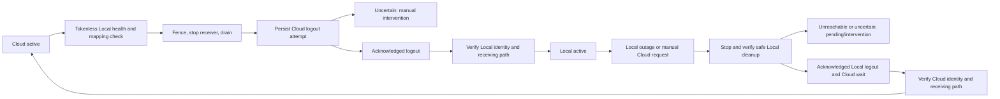

# Per-bot Telegram Cloud / Local endpoints

## Scope and operational boundary

Cloud is the upgrade/install default. Existing bots do not migrate after deployment. A current global Super Admin can select a bot from **🗽 Admin → 🌐 مدیریت Telegram API**, or use `/telegram_api` in any healthy configured owned bot's private chat. Tenant ownership, customer privileges, assistant hosts and group chats grant no endpoint authority. The panel inventories owned, tenant and assistant identities; logger delivery selects existing eligible owned Cloud bots and reserves no dedicated identity.

Reuse the existing official Local Bot API at `http://127.0.0.1:8081` on Nethederland. Adminbot does not install, manage, restart, stop, reconfigure or inspect private credentials of the downloader container. The Local port must remain bound to loopback. No new `api_id` / `api_hash` is used.

Primary references:

- [Telegram logOut / close](https://core.telegram.org/bots/api#logout): logOut is required before launching the bot locally; Cloud login is prohibited for ten minutes after successful Cloud logout. `close` moves a bot between Local servers and is not a logout substitute.
- [Official server migration and file behavior](https://github.com/tdlib/telegram-bot-api/blob/master/README.md): simultaneous sessions have no update-delivery guarantee; local-mode GetFile returns absolute server filesystem paths.
- [Existing downloader Local API procedure](https://github.com/HamedSanaei/telegram-media-downloader-bot/blob/main/docs/LOCAL_BOT_API.md): persist intent, never blindly repeat uncertain logout, and retain explicit rollback cooldown.
- [Pinned SDK options](https://github.com/TelegramBots/Telegram.Bot/blob/0fc69091287e0656d5b22ef2ebf829288e85cd2e/src/Telegram.Bot/TelegramBotClientOptions.cs) and [polling](https://github.com/TelegramBots/Telegram.Bot/blob/0fc69091287e0656d5b22ef2ebf829288e85cd2e/src/Telegram.Bot/TelegramBotClientExtensions.Polling.cs).

## Architecture

| Component | Responsibility |
|---|---|
| `TelegramEndpointStore` | Detached users.db snapshots, revision CAS, transactional history and deduplicated operator alert intents |
| `TelegramEndpointCoordinator` | Current-identity hydration, operator authorization, durable migration phases and safe recovery |
| `TelegramEndpointCoordinatorWorker` | Two tracked joined loops for migration and health; durable state is the work queue, with coalesced wakeups and bounded due-operation scans |
| `TelegramEndpointRuntimeGate` | Atomic pre-claim and complete-request/download leases; closes new admissions while admitted handlers drain |
| `BotClientProvider` / `EndpointRoutedTelegramBotClient` | Shared HTTP pool, cached per-endpoint epochs, reusable worker facade, pinned receiver epochs and exact identity checks |
| `MultiBotHostedService` | Existing per-bot lifecycle semaphore; stop/join old receiver and strict destination identity/webhook/poll readiness |
| `TelegramEndpointAdminService` / `TelegramEndpointPresentation` | Private owned-host global-admin panel, actual admission badges, evidence-backed outcomes and confirmed frozen-inventory batch reports |
| `TelegramEndpointCoordinator.Bulk` | Sequential per-bot intent admission through existing migration guards; explicit retained Cloud control and exact committed operation receipts |
| `TelegramEndpointNotificationWorker` | One durable incident sent directly to the existing logger channel through a counted, authorized active Cloud bot |
| Existing latency telemetry | Payload-free endpoint request/health/migration events and Cloud/Local reporting |

A bot's state key is `(internal BotId, exact numeric BotFather identity)`. Token rotation retaining the identity does not transfer selection to another bot. Replacing the identity gets a separate Cloud-default row; historical migration receipts remain private audit data and cannot activate the replacement. Startup hydrates current saved identities before any hosted sender/receiver starts. Pending/uncertain Local state is never interpreted as permission to log into Cloud.

`Revision` is the SQLite optimistic CAS version. `ControlRevision` changes only control-relevant intent/settings, not ordinary health refreshes. Endpoint `Generation` is monotonic per exact identity. Retained ordinary clients resolve the admitted generation for each complete operation; a retained pinned receiver cannot poll a newer epoch. Once an HTTP operation starts it cannot be rerouted/replayed. SDK retries remain zero; foreground deadlines, existing polling backoff/429/409 handling and scheduler concurrency are unchanged.

Newly current runtime identities remain fenced until exact durable hydration; returning A→B→A reloads A's saved epoch instead of guessing Cloud. A new internal alias with existing unsafe same-BotFather history is created as intervention/conflict, not an automatic Cloud login. Any current token-bearing duplicate BotFather alias blocks migration, including disabled bots: disabled owned bots retain background delivery and disabled tenants retain capability reads. The guard is repeated before logout; numeric-identity admission fencing/draining also covers aliases introduced during migration and identity probes already in flight.

Owner-panel/token-registration getMe probes now share the authority-aware pooled read-only transport. Already registered identities use their current admitted endpoint, including same-identity replacement secrets and authorized disabled-store capability reads. Unregistered tokens require bounded historical-alias cleanup/cooldown checks before Cloud; overflow or unavailable authority fails closed. The owner single-flight cache rechecks token/endpoint generation and migration fences before returning cached success.

Cloud-to-Local requires another enabled non-assistant owned BotFather identity with hydrated active Cloud admission. Disabled, Local, unhydrated, fenced and same-identity aliases do not count. The last independent Cloud control cannot migrate; this is checked at confirmation and again before logout, including opt-in automatic failback. Use `/telegram_api` on that retained host during a shared Local outage. Routing admission is not a guarantee against an independent Cloud/network outage; operators must start and verify the alternate host privately.

The scheduler acquires an endpoint execution lease **before** durable claim. A paused lane head stays queued, preserving strict per-bot/user FIFO and deduplication. Admitted handlers may finish their original epoch; migrations wait for handlers, requests and file transfers before session cleanup. Other bots continue independently. Lifecycle ownership is the existing runtime semaphore, not a second competing receiver lock. Management callbacks persist/enqueue intent and return before their own receiver or handler is drained.

Durable settlement, order, receipt and weekly notifications defer exact pre-HTTP endpoint fences; conditional claim release refunds provisional attempts rather than consuming network budgets during a long Cloud wait. Identity replacement remains manual review. Ambiguous payment HTTP/timeouts/5xx and receipt photo/fallback failures remain `DeliveryUncertain`, never endpoint-switch replay. Definite receipt photo rejections/file-read failures retain the existing fallback, but a potentially delivered photo never triggers a speculative second message.

## Reading status and using bulk migration

Inventory and bot detail screens begin with the **actual request-admission endpoint** in plain text. The simple screen shows connection, the latest migration result and fixed Persian corrective actions; machine metadata is not mixed into normal status.

| Panel headline | Exact meaning |
|---|---|
| `☁️ CLOUD` | The enabled exact identity currently admits ordinary requests through Cloud |
| `🏠 LOCAL` | The enabled exact identity currently admits ordinary requests through Local |
| `⛔ اتصال متوقف؛ پذیرش درخواست بسته است` | Admission is fenced; no ordinary new request may start, even if the saved effective endpoint is Cloud/Local |
| `⛔ اتصال غیرفعال؛ ربات غیرفعال است` | The current registry disables this bot |
| `❔ اتصال نامشخص؛ مسیر فعلی مشاهده نشده است` | Runtime observation is unavailable; no Cloud default is guessed |

During migration, **`⏳ در حال انتقال`** separates source → destination from the currently admitted/paused connection. A historical source is never labeled active after fencing. An admission badge is not a network-health or receiver-liveness guarantee.

**`🔍 جزئیات فنی`** contains generation/gate, desired/last-validated endpoints, BotFather identity, durable migration state, UTC timestamps, cooldown eligibility, failure code/phase/checked prerequisite/action, authoritative configuration source, startup/live mapping values, logger readiness and bounded recent history. Complete technical output is paginated without dropping long paths or diagnostics. Opening/refreshing technical pages is read-only: no health probe, config rewrite, migration admission or gate reopening. It inherits every authorization, identity, revision, expiry and replay check.

Success requires the exact current operation's committed destination activation receipt, matching destination and an activation timestamp at/after its start. Registration, a previous success, restored source, cooldown and uncertain logout never prove a new successful migration. A newer persisted validation refusal is shown separately from the earlier committed migration. Its finite failure category survives subsequent health refresh in history; no extra schema is needed. Batch success remains attributed only to its exact accepted operation. Nullable runtime observations remain `[NotMapped]`.

The full inventory offers **`🏠 انتقال همه ربات‌ها به Local…`** and **`☁️ انتقال همه ربات‌ها به Cloud…`**:

1. Open `/telegram_api` in a healthy enabled owned bot as a current global Super Admin; select the bulk destination.
2. Review and explicitly confirm. The entire inventory across **all pages**, exact BotFather identities and control revisions is frozen at confirmation. Disabled, tokenless, tenant and assistant entries remain visible; newly added or replaced bots cannot silently join.
3. The panel publishes progress and a read-only refresh control **before** admitting intents, because migration can fence the hosting bot. Each bot uses the existing individual migration API; registration is sequential and performs no receiver drain or Telegram protocol call. The existing worker executes accepted durable intents.
4. Refresh the report to see accepted, pending, successful, rejected/failed, uncertain, not-submitted, changed/unproven and retained-control counts plus paginated per-bot results. Already-on-target entries have a separate count and never count as a new successful migration. Refresh never submits or replays a request.
5. If the original host is unavailable, open `/telegram_api` in another healthy authorized owned host and select your recent batch report.

**Bulk Local retains one eligible independent owned Cloud control**, preferably the hosting bot, otherwise by ordinal internal id within the frozen inventory. It explicitly reports which bot stayed Cloud rather than claiming every bot migrated. The last-independent-Cloud safety rule is unchanged: disabled, fenced, unhydrated, Local, tenant, assistant and duplicate-identity configurations cannot satisfy it. This prevents a shared Local outage from removing every administration path; route eligibility alone still does not prove Cloud network health. Bulk Cloud considers every frozen entry, including the host, but never bypasses session cleanup or the recorded cooldown.

Bulk admission has a nonwaiting single-batch lock and uses the existing per-bot locks/CAS revisions. Concurrent individual changes produce visible busy/stale/refused outcomes. Global authority and exact host identity are rechecked between admissions. Cancellation or a persistence exception preserves the proven prefix, marks a possibly committed current admission uncertain and leaves the untouched tail unsubmitted; no automatic replay is added.

Callback confirmations/navigation remain actor/chat/message/host-bound, single-use and ten-minute expiring. Read-only actor-scoped reports have a separate **absolute one-hour** lifetime, bounded to 512 reports, so the ten-minute Cloud wait does not erase them before normal completion. After ten minutes reopen inventory for fresh controls; refresh does not extend report lifetime. Only the latest three reports for that actor are linked from inventory. Aggregate reports are process-local and disappear on restart/expiry; each accepted bot's operation, phase and audit history remain durable and available through its details. Pending operations continue after restart without resubmitting the batch.

This panel enhancement requires no new configuration, database migration, timeout change, receiver/FIFO change or notification transport. Bulk does not alter financial processing, retry ambiguous sends or control the downloader container. No bot changes endpoint until explicit confirmation.

## Durable phases and truthful availability



The persisted vocabulary distinguishes active `Cloud`, `Local`, `LocalDegraded`, `CloudRecovered`; checking/switching; Cloud/Local logout pending/uncertain; `LocalUnavailable`, `FallbackPending`, `CloudWait`, failure and `ManualInterventionRequired`. Selected and effective endpoints are separate. Automatic fallback preserves selected Local while effective Cloud becomes `CloudRecovered`; default recovery does not automatically move it back to Local.

Before first Local login, only the **tokenless HTTP root** is checked. The official server returns a bounded 404 Bot API JSON envelope. This proves process/HTTP reachability, not authentication or Telegram upstream connectivity. A real bot's Local `getMe` is not a harmless preflight: it can create a session and is prohibited before acknowledged Cloud logout. Cloud identity is checked first; destination identity must exactly match the persisted BotFather id.

Each irreversible call has a committed attempt marker before dispatch. A crash with the marker or an ambiguous response becomes explicit uncertainty; no restart repeats logOut. Definitive refusal can restore only the verified source. Target readiness requires identity validation, webhook absence/deletion with `dropPendingUpdates=false`, and a zero-offset/zero-timeout getUpdates probe. The probe does not confirm/remove updates; the real receiver admits them through the durable inbox. Only then is the effective target committed and ordinary admission enabled.

Cloud reuse eligibility is persisted. The implementation respects the official ten-minute Cloud logout restriction and adds a conservative fresh ten-minute wait after acknowledged Local logout, matching the downloader's rollback policy. This is deliberately more conservative than a BaseUrl swap. During wait there is no active receiver; the panel displays the earliest eligible UTC time. Eligibility is a necessary condition, not proof that login/readiness will succeed.

When Local is unreachable, bot-specific session cleanup cannot be proved. Fallback remains pending with bounded safe health retries, then manual intervention; **it does not claim Cloud recovery**. A recovered Local session may resume only before any Local logout attempt/uncertainty and after recovery hysteresis. A bot with acknowledged/uncertain Local cleanup must never be Local-probed or revived by ordinary health. Uncertain migration has no unsafe "force" button. Keep its durable records and obtain provider/session evidence before any operator-directed recovery; do not delete rows, edit generations or repeat logout to guess the answer.

## Health and automatic policy

Default health interval 15 seconds, short read deadline 3 seconds, outage threshold 3 consecutive relevant failures, recovery threshold 2 consecutive successes. Shared tokenless health is checked once per cycle; identity reads target only already-Local eligible sessions. Normal empty long polling is healthy and is not an outage signal. Status refresh on an active Cloud identity performs only safe Cloud reads, never a prelogout Local login.

Typed categories distinguish connection refusal, timeout/network, invalid Bot API response, token rejection/identity mismatch, rate limit and Telegram upstream failure. Telegram 429/5xx prove a different condition from an unavailable Local process; they do not trigger Local-server failover. Identity rejection requires intervention rather than a speculative endpoint switch. Failures are persisted without external exception text.

Outage episodes have stable ids and deduplicated alerts. New admissions are fenced, and the affected receiver is stopped under bot-specific lifecycle ownership. Safe recovery is bounded by configured attempts and exponential delay; no indefinitely repeated mutation occurs. Automatic failback is a separate explicit startup policy, disabled by default; when enabled it still executes the same Cloud logout protocol and recovery thresholds.

## Direct logger-channel notifications

Endpoint incidents go directly to the existing **`loggerChannel`**, never private Super Admin chats or the generic logger queue. The live root value takes precedence, with the current default bot's sanitized logger channel as fallback. No new bot, `notificationBotId` or `notificationTelegramBotId` is required; those routing options have been removed. Old keys left in an existing private configuration are ignored, not rewritten.

The worker prefers the existing default owned bot when eligible, then checks a bounded rotating page of other enabled owned non-assistant bots. Current hydrated **Cloud/CloudRecovered** admission is mandatory: Local, migrating, fenced, disabled, replaced and unhydrated bots cannot even probe Cloud. It uses the existing pooled SDK with `https://api.telegram.org`, verifies exact `getMe` identity, resolves `getChat` to a negative **channel** id, and checks the same bot's `getChatMember` owner or administrator `can_post_messages` authority. Tenants/assistants are intentionally excluded from this global operational transport.

One normal request lease spans the read-only checks, SQLite send marker and complete send. Identity/token/generation/admission are rechecked across awaited boundaries; migration must drain that lease before logout. No migration-control bypass or speculative send is used. Definite pre-send permission denial may try another eligible sender; after dispatch, no alternate bot or endpoint is tried.

State transition, one incident-only intent and permanent deduplication receipt commit together in users.db, including when no admins/logger/sender are configured. Missing logger, posting authority or active Cloud sender leaves the alert **Pending indefinitely**, refunds the unused claim attempt and schedules a bounded `retryMaxSeconds` delay (default 300 seconds). Fixed local console/file warnings record the condition; the exact retained-worker warning is excluded from generic Telegram logging to prevent recursion or unsafe Local fallback. Real failed read attempts and definitive send 429 still use the finite `notificationMaxAttempts` policy; permanent send rejection requires `ManualReview`.

The verified negative destination is frozen at the durable send marker. Explicit 429 retries and proven undispatched post-marker deferrals keep that channel even if configuration changes; a config edit cannot redirect an already bound incident. Acknowledgment is required for Delivered. Timeout/disconnect/5xx or interruption after invoking send becomes **DeliveryUncertain**, never automatic replay. A post-marker prerequisite loss can return Pending only while the worker proves it has not invoked the SDK send.

Migration `20261009130000_RouteEndpointIncidentsToLoggerChannel` consolidates old per-admin rows/receipts to one incident. Only provably unsent legacy incidents resume Pending. Old acknowledged/pruned receipts suppress new sends; started/uncertain incidents stay quarantined. Legacy Delivered rows can have no channel destination or acknowledgment timestamp: they represent prior private delivery evidence, not a new channel send. Detailed acknowledged history retains the existing 90-day pruning; compact incident receipts remain permanent.

Alerts cover Local outage/recovery, migration, delayed fallback/cooldown and intervention. Persian bodies are rendered at delivery, never stored with tokens or raw provider payloads. The panel exposes Pending/uncertain counts; actual channel membership/permission/network readiness must be verified in a separately approved production rollout.

## Configuration and file prerequisites

Add only the optional `telegramEndpointRouting` object to the existing persistent `Data/configuration.json`; never regenerate or prune production configuration from the example. Defaults are in `Data/configuration.example.json`:

```json
{
  "telegramEndpointRouting": {
    "enabled": true,
    "cloudBaseUrl": "https://api.telegram.org",
    "localBaseUrl": "http://127.0.0.1:8081",
    "healthCheckIntervalSeconds": 15,
    "healthCheckTimeoutSeconds": 3,
    "failureThreshold": 3,
    "recoveryThreshold": 2,
    "automaticFailback": false,
    "migrationDrainSeconds": 30,
    "migrationTimeoutSeconds": 30,
    "recoveryMaxAttempts": 12,
    "retryMaxSeconds": 300,
    "notificationMaxAttempts": 12,
    "localFileServerRoot": "",
    "localFileHostRoot": ""
  }
}
```

Only official HTTPS `api.telegram.org` and configured HTTP loopback origins are accepted. Paths, credentials, fragments, queries, remote Local hosts and arbitrary UI-entered URLs are rejected. No secrets are added to the routing options. Settings are snapshotted at startup; per-bot selection/failover/state is live and durable without application restart.

Official `--local` GetFile returns absolute paths **inside the existing server/container**. Its HTTP request listener is not the Cloud `/file/bot…` download service. Adminbot copies through an explicitly configured read-only mapping from `localFileServerRoot` to `localFileHostRoot`. The downloader's published Compose binds `./data` to `/data`; inspect the actual existing mounts/directory read-only to select exact roots. Do not assume the illustrative downloader default is the production path. Do not change its container, ownership or configuration.

The host directory must already exist, be searchable/listable by the Adminbot process, and contain no symbolic-link/reparse components. Linux validation uses effective credentials/ACLs (`faccessat`) and a bounded directory listing, not guessed mode bits; it reads no customer file contents and writes no probe files. Missing/invalid roots, missing directory, denied access, links and filesystem failures have distinct closed diagnostic categories. Malformed mapping no longer takes down independent Cloud administration at startup: validation instead fails closed at Local admission, both irreversible prelogout rechecks and Local file resolution. Trusted origins/resource limits still fail startup. Returned paths require same-facade GetFile provenance, containment without traversal and the correct generation. Per-file permission failures remain explicit delivery errors, never HTTP fallback or resend.

The TGFile overload retains weak object provenance; string-path compatibility bindings are capped at 512 per facade, so a stale/evicted Local path must be looked up again. File paths/content, tokens and credentials remain absent from request telemetry and logs; trusted root paths are shown only in the authenticated operator technical view.

### Authoritative configuration and Gozargah blocker

`ApplicationConfigurationSource` loads only `<IWebHostEnvironment.ContentRootPath>/Data/configuration.json`, prints its absolute path at startup, and supplies that path to technical details. The previous unbased `AddJsonFile` used the assembly-directory provider: an isolated reproduction with content-root `/data` and a conflicting assembly copy read `/stale`. The explicit provider now reads `/data`. This is a separately reproduced loader defect, **not evidence that production read the wrong file**.

Read-only inspection on **2026-10-09** established the current production prerequisite failure:

| Evidence | Observation |
|---|---|
| Active service working directory | `/root/vpnetiran/bin/Release/net10.0/linux-x64/publish` |
| Actual private configuration | `/root/vpnetiran/bin/Release/net10.0/linux-x64/publish/Data/configuration.json` |
| Configuration before current process start | Entire `telegramEndpointRouting` section absent; neither mapping key exists at root either |
| Expected host directory | `/opt/telegram-media-downloader-bot/data` exists, readable/searchable by the current root service account, with no linked ancestor |
| Tokenless Local root | Official HTTP 404 Bot API envelope at loopback; reachability only, not bot authentication |
| Gozargah exact configured/durable identity | Matches; desired/effective/state Cloud, generation 1 |
| Gozargah durable migration evidence | Zero history rows; no migration/logout/acknowledgment/cooldown timestamps |

Thus the observed blocker is **`LOCAL_FILE_MAPPING_MISSING` at `local_file_mapping`**, before intent or Cloud logout. The old generic `unavailable` result hid it. This check did not prove live token authentication, historical failure causes or destination readiness; no token-bearing production call, logout, config write, service action or Docker mutation occurred.

An authorized operator must add only these required keys within the existing `telegramEndpointRouting` section of the **actual active private file**, preserving all unrelated settings/secrets:

```json
{
  "telegramEndpointRouting": {
    "localFileServerRoot": "/data",
    "localFileHostRoot": "/opt/telegram-media-downloader-bot/data"
  }
}
```

These values describe the existing downloader mount; they do not install or modify it. Mapping is startup-bound to protect file/endpoint generations. If live configuration differs, technical details explicitly require a deliberate application restart after the separately approved config/deployment change; a panel refresh cannot hot-remap existing clients. No production configuration was changed by this patch.

### Diagnosing admission versus execution

| Technical category example | Boundary and operator action |
|---|---|
| `LOCAL_FILE_MAPPING_MISSING` / `LOCAL_FILE_MAPPING_INVALID` | Validation; complete/correct absolute roots in the authoritative source, then apply startup configuration deliberately |
| `LOCAL_FILE_HOST_MISSING` / `LOCAL_FILE_ACCESS_DENIED` / `LOCAL_FILE_PATH_LINKED` | Validation; inspect the exact existing mount and actual service-account access, never bypass links/containment or change the downloader container |
| `MIGRATION_IN_PROGRESS` / `BUSY` / `STALE` | No new intent admitted; observe current operation or obtain fresh controls rather than replaying an old callback |
| `LOCAL_ROOT_CONNECTION_REFUSED` / `LOCAL_ROOT_TIMEOUT` | Tokenless Local preflight failed; inspect loopback process/network availability |
| `CLOUD_SOURCE_IDENTITY_IDENTITY_MISMATCH` / `LOCAL_DESTINATION_IDENTITY_IDENTITY_MISMATCH` | Exact identity validation failed at the named source/destination boundary; destination is never reported successful |
| `CLOUD_LOGOUT_REFUSED` / `CLOUD_LOGOUT_UNCERTAIN` | Definite refusal versus ambiguous mutation; the latter cannot safely be repeated |
| `LOCAL_DESTINATION_RECEIVER_NOT_READY` | Destination identity alone is insufficient; receiving readiness must succeed |
| `CLOUD_COOLDOWN` | Legitimate provider wait, not an admission error or completed Cloud migration |

JSONL `telegram_endpoint_migration` retains lowercase closed `category`, uppercase `failureClassification`, controlled `stage`/`operation`, outcome and existing endpoint fields. Intermediate transitions use `in_progress`; only committed destination activation is success. Technical history retains the finite failure code in `Outcome` only on failure/refusal/uncertain/retry/reconciliation receipts, leaving successful/requested state receipts unchanged. No raw errors, URLs, payloads or credentials are introduced.

After a separately approved deployment/config application, first verify technical details show the exact source and both **startup** roots. Keep another authorized active owned Cloud control. Explicitly confirm the dedicated test bot migration, then refresh from the independent control until **`🏠 LOCAL` + `✅ نتیجه انتقال: موفق`** appear together. Technical history must show the same operation's acknowledged Cloud logout and `migration_succeeded` after exact Local identity/receiver validation. Exercise a benign message and file download on the dedicated bot; only then explicitly migrate Gozargah. `accepted`, a desired Local value, root 404 or a logout acknowledgment alone is not success.


## Persistence and deployment

Additive migration: `20261009120000_AddTelegramEndpointRouting` in **users.db only**. Four endpoint-only tables: states, append-only history, operator alert outbox and compact alert receipts. No financial/tenant columns are rewritten, no cascade references, and no new production project, dependency, API secret or telemetry database is introduced. SQLite retries contain database work only; no network mutation runs inside a retried transaction.

The logger-channel cutover migration rebuilds **only the two endpoint alert/receipt tables**, removes private recipient ids and preserves incident delivery fences. Endpoint state/history, FIFO and financial schemas are unchanged. Run isolated migration preflight on backups before activation. Its Down path deliberately refuses to reconstruct discarded recipients; do not roll back to the previous per-private-recipient worker against this schema or restore an old financial database to reverse notification routing.

Existing deployment preserves users.db and configuration. Immutable releases share `/opt/vpnetiran/shared/Data`; synchronized deployment preserves its existing application Data. JSONL remains `Telemetry/` adjacent to the resolved users.db, with existing retention/security/publish exclusions. No new endpoint state file is copied from publish. Never expose endpoint control/telemetry through a public HTTP endpoint.

## Staged rollout and read-only validation

1. Deploy the normal single application artifact with all existing bots still Cloud. Run the existing isolated migration preflight on backups first; ordinary startup applies the additive migration before receivers.
2. Verify `/telegram_api` from two healthy authorized owned administration paths. Confirm selected/effective Cloud, current identity and strict callback authority.
3. Verify the existing logger channel and at least one existing active owned Cloud bot's posting access; no dedicated notifier setup or private `/start` is needed. Configure the read-only file mapping after inspecting existing mounts/permissions. Confirm a benign dedicated-test-bot incident arrives once in the logger channel.
4. Migrate one dedicated test bot only after explicit panel confirmation. Check identity, poll readiness, message/edit/media/file delivery, durable inbox receipts and endpoint generations.
5. Exercise outage/cooldown/restart only against isolated fake/test Local infrastructure. Never stop the shared downloader container or issue production logOut from automated tests.
6. Only after those checks, explicitly confirm Local for `GozargahNetwork_Bot`. Monitor errors, durable state/history and Cloud/Local telemetry; expand one identity at a time.

Read-only production checks, run by an authorized operator rather than automated by this task:

```bash
systemctl show vpnetiranbot.service -p ActiveState -p SubState -p User -p WorkingDirectory -p ExecStart
curl --max-time 3 --silent http://127.0.0.1:8081/
# Official root is an HTTP 404 with a Bot API error JSON object, not a health endpoint returning 200.
docker inspect --format '{{json .Mounts}}' telegram-media-downloader-local-api-1
# Review locally: do not paste private volume paths/configuration or full container environment into logs.
./Adminbot --migration-check --users-source /absolute/persistent/Data/users.db --credentials-source /absolute/persistent/Data/credentials.db
./Adminbot telemetry-report --hours 24 --bot GozargahNetwork_Bot --directory /absolute/persistent/Data/Telemetry
```

The migration preflight copies source databases through SQLite online backup, migrates only temporary copies and starts no receiver. Panel history is private operator audit; do not export actor ids. Compare request series by bot, endpoint, method and HTTP-header/SDK/foreground boundary; never sum overlapping views. Endpoint events include health duration, generation/state, failures, recovery/cooldown and closed reason categories. Per-process failover durations are monotonic; unavailable restart-origin timing is null rather than fabricated.

## Safe disable and rollback

`enabled=false` disables new endpoint management/monitor work; **it does not discard saved routes or silently force Local bots to Cloud**. Existing active Local traffic still needs the configured loopback endpoint and valid file mapping. Complete any safe pending migration before intentionally disabling management. Keep manual failback unless separately approved.

Before rolling back to a release that does not understand routing, safely migrate every Local identity to Cloud using this release, wait for the recorded eligibility and verify Cloud receiving readiness. Resolve uncertain/pending cleanup with provider evidence first; an older Cloud-only binary is not safe to start while a Local/uncertain session exists. Do not downgrade/drop the additive tables, restore an old financial database, discard pending alerts or reset generations. Retain the current capable release when safety cannot be proved. The existing deployment rollback mechanism preserves databases but cannot override Telegram's session restrictions.

The logger-channel outbox cutover is intentionally not downgradable to private recipients. Keep the current schema-aware worker/receipts; an older private-recipient worker is incompatible even after bots return to Cloud. No migration Down or database reset is a safe notification rollback.

## Verification and limits

Deterministic coverage lives in the existing `Adminbot.Tests` project: panel/global-authority/replay/identity, durable CAS/alerts/migration upgrade, real v22 pooled origin routing and generation/file fencing, actual receiver lifecycle/FIFO isolation, fake migration/health/cooldown/crash/ambiguous sends and endpoint JSONL/reporting. Automated verification uses synthetic tokens and in-process transports only; no production bot token, Local session or downloader process is exercised.

Observed verification (initial routing smoke rows are explicitly labeled):

| Check | Observed result |
|---|---|
| Current simplified-panel/config/mapping focused Release regressions | 254 passed; zero failed/skipped; actual SDK screens, file/source validation, phase-qualified errors, cooldown/restart, authority/replay and JSONL diagnostics covered |
| Current complete Release regression suite | 1,622 passed; zero failed/skipped; pre-existing warnings remain in unrelated test files, no new warning in changed tests |
| Current real panel/coordinator/gate smoke on Windows and isolated Linux | CLOUD → validated LOCAL → truthful CloudWait/paused connection → validated CLOUD; maximum one receiver; one fake logout per direction; missing mapping and unreachable root perform zero logout |
| Current Linux effective-access smoke | Accessible directory accepted; actual mode-000 directory denied under uid 1000; real symlink rejected; missing directory classified. Temporary self-contained launcher only; invariant globalization because this isolated WSL image lacks ICU, not a production configuration change |
| Current configuration-source before/after smoke | Original loader selected conflicting assembly `/stale`; fixed explicit content-root provider selected `/data` on Windows/Linux |
| Current smoke JSONL | 22 observations across round-trip and refusal scenarios; zero dropped events/writer failures; exact stage/code retained |
| Logger-channel cutover verification retained from the previous change | 202 focused regressions and 1,496 complete Release regressions passed; missing/configured logger labels and actual channel worker were exercised through fake HTTP without private delivery |
| Endpoint status/bulk focused Release regressions | 265 passed; zero failed/skipped; actual gate observations, operation evidence, full-inventory admission, authorization/replay/concurrency, cooldown/restart and ambiguous persistence covered |
| Complete Release regression suite after status/bulk enhancement | 1,561 passed; zero failed/skipped; includes existing tenant/financial, FIFO, endpoint protocol and durable logger-outbox regressions |
| Actual status/bulk private-panel callback smoke with real coordinator/gate and fake protocol/lifecycle | Cloud inventory → confirmed bulk Local → validated Local success with retained Cloud control → bulk Cloud wait with no active route → validated Cloud success after controlled eleven-minute advance; current-operation success and already-on-target counts remain separate; no live Telegram traffic |
| Release application build | Success; zero warnings/errors |
| `dotnet publish Adminbot.csproj -c Release -f net10.0 -r linux-x64 --self-contained false` | Success; single production application, no auxiliary project dependency; clean external publish contains no tests, private databases/configuration or telemetry archives |
| Both EF `has-pending-model-changes` checks | No pending model changes |
| Isolated Release `--migration-check` | UserDbContext and CredentialsDbContext OK |
| Initial routing two-bot runtime smoke using the actual v22 SDK, receiver service, private panel and scratch SQLite | Cloud → Local → CloudWait → Cloud; exactly one source poller maximum; independent Cloud control/panel remained available during wait |
| Initial routing smoke JSONL | 80 endpoint observations; zero dropped events/writer faults; synthetic tokens absent |
| Initial routing read-only analyzer against synthetic Cloud/Local archive | Independent endpoint/method/boundary quantiles and migration history displayed; no receiver/worker startup |
| Logger-channel runtime smoke using the actual worker, v22 SDK and migrated scratch SQLite | Existing Cloud bot posts once to the verified channel; no eligible Cloud sender stays Pending beyond attempt cap; lost send response is DeliveryUncertain with no replay. Fake HTTP only; no private destination or live mutation |

The controlled benchmark and allocation caveats are recorded in [latency telemetry verification](telegram-latency-telemetry.md#controlled-overhead-benchmark-and-verification). Temporary smoke/report tooling lives outside the repository and is removed after verification.

Automated fake transports do not prove production network quality, live token authentication, full service-account file-transfer permissions, notification audience or real Telegram session behavior. The read-only production check above proves only current root-directory access and tokenless Local reachability; per-file access, post-deployment settings and the actual receiving path still require the explicitly authorized dedicated test bot. API acknowledgment is not proof a user read the message, and elapsed cooldown is not proof an unreachable Local session was cleaned up. Uncertain alert delivery/migration remain visible for human review.
