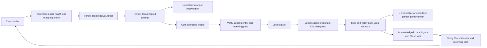

# Per-bot Telegram Cloud / Local endpoints

## Scope and operational boundary

Cloud is the upgrade/install default. Existing bots do not migrate after deployment. A current global Super Admin can select a bot from **🗽 Admin → 🌐 مدیریت Telegram API**, or use `/telegram_api` in any healthy configured owned bot's private chat. Tenant ownership, customer privileges, assistant hosts and group chats grant no endpoint authority. The same panel inventories owned, tenant and assistant identities; the explicitly reserved notification identity cannot migrate.

Reuse the existing official Local Bot API at `http://127.0.0.1:8081` on Nethederland. Adminbot does not install, manage, restart, stop, reconfigure or inspect private credentials of the downloader container. The Local port must remain bound to loopback. No new `api_id` / `api_hash` is used.

Primary references:

- [Telegram logOut / close](https://core.telegram.org/bots/api#logout): logOut is required before launching the bot locally; Cloud login is prohibited for ten minutes after successful Cloud logout. `close` moves a bot between Local servers and is not a logout substitute.
- [Official server migration and file behavior](https://github.com/tdlib/telegram-bot-api/blob/master/README.md): simultaneous sessions have no update-delivery guarantee; local-mode GetFile returns absolute server filesystem paths.
- [Existing downloader Local API procedure](https://github.com/HamedSanaei/telegram-media-downloader-bot/blob/main/docs/LOCAL_BOT_API.md): persist intent, never blindly repeat uncertain logout, and retain explicit rollback cooldown.
- [Pinned SDK options](https://github.com/TelegramBots/Telegram.Bot/blob/0fc69091287e0656d5b22ef2ebf829288e85cd2e/src/Telegram.Bot/TelegramBotClientOptions.cs) and [polling](https://github.com/TelegramBots/Telegram.Bot/blob/0fc69091287e0656d5b22ef2ebf829288e85cd2e/src/Telegram.Bot/TelegramBotClientExtensions.Polling.cs).

## Architecture

| Component | Responsibility |
|---|---|
| `TelegramEndpointStore` | Detached users.db snapshots, revision CAS, transactional history and deduplicated operator alert intents |
| `TelegramEndpointCoordinator` | Current-identity hydration, operator authorization, durable migration phases and safe recovery |
| `TelegramEndpointCoordinatorWorker` | Two tracked joined loops for migration and health; durable state is the work queue, with coalesced wakeups and bounded due-operation scans |
| `TelegramEndpointRuntimeGate` | Atomic pre-claim and complete-request/download leases; closes new admissions while admitted handlers drain |
| `BotClientProvider` / `EndpointRoutedTelegramBotClient` | Shared HTTP pool, cached per-endpoint epochs, reusable worker facade, pinned receiver epochs and exact identity checks |
| `MultiBotHostedService` | Existing per-bot lifecycle semaphore; stop/join old receiver and strict destination identity/webhook/poll readiness |
| `TelegramEndpointAdminService` | Private owned-host global-admin panel, ten-minute message/actor/host/identity-bound single-use controls |
| `TelegramEndpointNotificationWorker` | Durable independent Cloud-only operator alerts; phase-aware uncertainty without send replay |
| Existing latency telemetry | Payload-free endpoint request/health/migration events and Cloud/Local reporting |

A bot's state key is `(internal BotId, exact numeric BotFather identity)`. Token rotation retaining the identity does not transfer selection to another bot. Replacing the identity gets a separate Cloud-default row; historical migration receipts remain private audit data and cannot activate the replacement. Startup hydrates current saved identities before any hosted sender/receiver starts. Pending/uncertain Local state is never interpreted as permission to log into Cloud.

`Revision` is the SQLite optimistic CAS version. `ControlRevision` changes only control-relevant intent/settings, not ordinary health refreshes. Endpoint `Generation` is monotonic per exact identity. Retained ordinary clients resolve the admitted generation for each complete operation; a retained pinned receiver cannot poll a newer epoch. Once an HTTP operation starts it cannot be rerouted/replayed. SDK retries remain zero; foreground deadlines, existing polling backoff/429/409 handling and scheduler concurrency are unchanged.

Newly current runtime identities remain fenced until exact durable hydration; returning A→B→A reloads A's saved epoch instead of guessing Cloud. A new internal alias with existing unsafe same-BotFather history is created as intervention/conflict, not an automatic Cloud login. Any current token-bearing duplicate BotFather alias blocks migration, including disabled bots: disabled owned bots retain background delivery and disabled tenants retain capability reads. The guard is repeated before logout; numeric-identity admission fencing/draining also covers aliases introduced during migration and identity probes already in flight.

Owner-panel/token-registration getMe probes now share the authority-aware pooled read-only transport. Already registered identities use their current admitted endpoint, including same-identity replacement secrets and authorized disabled-store capability reads. Unregistered tokens require bounded historical-alias cleanup/cooldown checks before Cloud; overflow or unavailable authority fails closed. The owner single-flight cache rechecks token/endpoint generation and migration fences before returning cached success.

Cloud-to-Local requires another enabled non-assistant owned BotFather identity with hydrated active Cloud admission. Disabled, Local, unhydrated, fenced and same-identity aliases do not count. The last independent Cloud control cannot migrate; this is checked at confirmation and again before logout, including opt-in automatic failback. Use `/telegram_api` on that retained host during a shared Local outage. Routing admission is not a guarantee against an independent Cloud/network outage; operators must start and verify the alternate host privately.

The scheduler acquires an endpoint execution lease **before** durable claim. A paused lane head stays queued, preserving strict per-bot/user FIFO and deduplication. Admitted handlers may finish their original epoch; migrations wait for handlers, requests and file transfers before session cleanup. Other bots continue independently. Lifecycle ownership is the existing runtime semaphore, not a second competing receiver lock. Management callbacks persist/enqueue intent and return before their own receiver or handler is drained.

Durable settlement, order, receipt and weekly notifications defer exact pre-HTTP endpoint fences; conditional claim release refunds provisional attempts rather than consuming network budgets during a long Cloud wait. Identity replacement remains manual review. Ambiguous payment HTTP/timeouts/5xx and receipt photo/fallback failures remain `DeliveryUncertain`, never endpoint-switch replay. Definite receipt photo rejections/file-read failures retain the existing fallback, but a potentially delivered photo never triggers a speculative second message.

## Durable phases and truthful availability



The persisted vocabulary distinguishes active `Cloud`, `Local`, `LocalDegraded`, `CloudRecovered`; checking/switching; Cloud/Local logout pending/uncertain; `LocalUnavailable`, `FallbackPending`, `CloudWait`, failure and `ManualInterventionRequired`. Selected and effective endpoints are separate. Automatic fallback preserves selected Local while effective Cloud becomes `CloudRecovered`; default recovery does not automatically move it back to Local.

Before first Local login, only the **tokenless HTTP root** is checked. The official server returns a bounded 404 Bot API JSON envelope. This proves process/HTTP reachability, not authentication or Telegram upstream connectivity. A real bot's Local `getMe` is not a harmless preflight: it can create a session and is prohibited before acknowledged Cloud logout. Cloud identity is checked first; destination identity must exactly match the persisted BotFather id.

Each irreversible call has a committed attempt marker before dispatch. A crash with the marker or an ambiguous response becomes explicit uncertainty; no restart repeats logOut. Definitive refusal can restore only the verified source. Target readiness requires identity validation, webhook absence/deletion with `dropPendingUpdates=false`, and a zero-offset/zero-timeout getUpdates probe. The probe does not confirm/remove updates; the real receiver admits them through the durable inbox. Only then is the effective target committed and ordinary admission enabled.

Cloud reuse eligibility is persisted. The implementation respects the official ten-minute Cloud logout restriction and adds a conservative fresh ten-minute wait after acknowledged Local logout, matching the downloader's rollback policy. This is deliberately more conservative than a BaseUrl swap. During wait there is no active receiver; the panel displays the earliest eligible UTC time. Eligibility is a necessary condition, not proof that login/readiness will succeed.

When Local is unreachable, bot-specific session cleanup cannot be proved. Fallback remains pending with bounded safe health retries, then manual intervention; **it does not claim Cloud recovery**. A recovered Local session may resume only before any Local logout attempt/uncertainty and after recovery hysteresis. A bot with acknowledged/uncertain Local cleanup must never be Local-probed or revived by ordinary health. Uncertain migration has no unsafe "force" button. Keep its durable records and obtain provider/session evidence before any operator-directed recovery; do not delete rows, edit generations or repeat logout to guess the answer.

## Health and automatic policy

Default health interval 15 seconds, short read deadline 3 seconds, outage threshold 3 consecutive relevant failures, recovery threshold 2 consecutive successes. Shared tokenless health is checked once per cycle; identity reads target only already-Local eligible sessions. Normal empty long polling is healthy and is not an outage signal. Status refresh on an active Cloud identity performs only safe Cloud reads, never a prelogout Local login.

Typed categories distinguish connection refusal, timeout/network, invalid Bot API response, token rejection/identity mismatch, rate limit and Telegram upstream failure. Telegram 429/5xx prove a different condition from an unavailable Local process; they do not trigger Local-server failover. Identity rejection requires intervention rather than a speculative endpoint switch. Failures are persisted without external exception text.

Outage episodes have stable ids and deduplicated alerts. New admissions are fenced, and the affected receiver is stopped under bot-specific lifecycle ownership. Safe recovery is bounded by configured attempts and exponential delay; no indefinitely repeated mutation occurs. Automatic failback is a separate explicit startup policy, disabled by default; when enabled it still executes the same Cloud logout protocol and recovery thresholds.

## Independent Super Admin notifications

Configure a dedicated **enabled owned bot identity that stays Cloud-only**, not the affected Local bot and not an inferred default. Bind both its internal id and exact numeric BotFather identity. Every configured global Super Admin must first start that notifier bot privately. The reserved identity, including aliases, cannot migrate. Historic Local intent/session evidence disqualifies it as a Cloud-only notifier.

Alert intent and state transition commit in the same users.db transaction. Notification delivery never holds a migration transaction or blocks migration. Missing/unavailable transport retains visible pending intents and bounded backoff. Attempts eventually enter `ManualReview`, not silent deletion. A removed global admin is rejected again immediately before the send boundary.

A send-start marker separates safe pre-send failures from potentially delivered requests. Timeout/disconnect or interruption after that marker becomes `DeliveryUncertain` and is not automatically resent. Acknowledged delivery is recorded independently. This prioritizes no duplicate ambiguous sends over an impossible exactly-once Telegram guarantee. The panel displays undelivered/uncertain alert count and does not promise real-time notification merely because configuration exists. Detailed delivered outbox history expires after 90 days; compact permanent incident/recipient receipts prevent recreation after pruning.

Alerts cover outage, migration start, delayed fallback/cooldown, success/failure, intervention and Local recovery, with readable Persian state/error labels. Raw telemetry is never forwarded event-by-event. Existing local incident logging remains available if Telegram notifications fail.

## Configuration and file prerequisites

Add only the optional `telegramEndpointRouting` object to the existing persistent `Data/configuration.json`; never regenerate or prune production configuration from the example. Defaults are in `Data/configuration.example.json`:

```json
{
  "telegramEndpointRouting": {
    "enabled": true,
    "cloudBaseUrl": "https://api.telegram.org",
    "localBaseUrl": "http://127.0.0.1:8081",
    "healthCheckIntervalSeconds": 15,
    "healthCheckTimeoutSeconds": 3,
    "failureThreshold": 3,
    "recoveryThreshold": 2,
    "automaticFailback": false,
    "migrationDrainSeconds": 30,
    "migrationTimeoutSeconds": 30,
    "recoveryMaxAttempts": 12,
    "retryMaxSeconds": 300,
    "notificationMaxAttempts": 12,
    "notificationBotId": "",
    "notificationTelegramBotId": null,
    "localFileServerRoot": "",
    "localFileHostRoot": ""
  }
}
```

Only official HTTPS `api.telegram.org` and configured HTTP loopback origins are accepted. Paths, credentials, fragments, queries, remote Local hosts and arbitrary UI-entered URLs are rejected. No secrets are added to the routing options. Settings are snapshotted at startup; per-bot selection/failover/state is live and durable without application restart.

Official `--local` GetFile returns absolute paths **inside the existing server/container**. Its HTTP request listener is not the Cloud `/file/bot…` download service. Adminbot copies through an explicitly configured read-only mapping from `localFileServerRoot` to `localFileHostRoot`. The downloader's published Compose binds `./data` to `/data`; inspect the actual existing mounts/directory read-only to select exact roots. Do not assume the illustrative downloader default is the production path. Do not change its container, ownership or configuration.

The host directory must already exist, be readable by the Adminbot service account, and contain no symbolic-link/reparse components. Missing mapping blocks Local migration **before Cloud logout**. Returned paths must have successful same-facade GetFile provenance, lie beneath the trusted mapping, contain no traversal and belong to the lookup generation. Files are read only; paths, tokens, file contents and credentials are not logged. The TGFile overload retains weak object provenance; string-path compatibility bindings are capped at 512 per facade, so a stale/evicted Local path must be looked up again. Per-file permissions can still fail after root validation and remain an explicit delivery failure, not an HTTP fallback or resend.

## Persistence and deployment

Additive migration: `20261009120000_AddTelegramEndpointRouting` in **users.db only**. Four endpoint-only tables: states, append-only history, operator alert outbox and compact alert receipts. No financial/tenant columns are rewritten, no cascade references, and no new production project, dependency, API secret or telemetry database is introduced. SQLite retries contain database work only; no network mutation runs inside a retried transaction.

Existing deployment preserves users.db and configuration. Immutable releases share `/opt/vpnetiran/shared/Data`; synchronized deployment preserves its existing application Data. JSONL remains `Telemetry/` adjacent to the resolved users.db, with existing retention/security/publish exclusions. No new endpoint state file is copied from publish. Never expose endpoint control/telemetry through a public HTTP endpoint.

## Staged rollout and read-only validation

1. Deploy the normal single application artifact with all existing bots still Cloud. Run the existing isolated migration preflight on backups first; ordinary startup applies the additive migration before receivers.
2. Verify `/telegram_api` from two healthy authorized owned administration paths. Confirm selected/effective Cloud, current identity, strict callback authority and reserved notifier visibility.
3. Configure the independent Cloud notifier and read-only file mapping after inspecting existing mounts/permissions. Validate an operator receives a benign dedicated-test-bot migration incident; do not rely on the affected bot's token for alerts.
4. Migrate one dedicated test bot only after explicit panel confirmation. Check identity, poll readiness, message/edit/media/file delivery, durable inbox receipts and endpoint generations.
5. Exercise outage/cooldown/restart only against isolated fake/test Local infrastructure. Never stop the shared downloader container or issue production logOut from automated tests.
6. Only after those checks, explicitly confirm Local for `GozargahNetwork_Bot`. Monitor errors, durable state/history and Cloud/Local telemetry; expand one identity at a time.

Read-only production checks, run by an authorized operator rather than automated by this task:

```bash
systemctl show vpnetiranbot.service -p ActiveState -p SubState -p User -p WorkingDirectory -p ExecStart
curl --max-time 3 --silent http://127.0.0.1:8081/
# Official root is an HTTP 404 with a Bot API error JSON object, not a health endpoint returning 200.
docker inspect --format '{{json .Mounts}}' telegram-media-downloader-local-api-1
# Review locally: do not paste private volume paths/configuration or full container environment into logs.
./Adminbot --migration-check --users-source /absolute/persistent/Data/users.db --credentials-source /absolute/persistent/Data/credentials.db
./Adminbot telemetry-report --hours 24 --bot GozargahNetwork_Bot --directory /absolute/persistent/Data/Telemetry
```

The migration preflight copies source databases through SQLite online backup, migrates only temporary copies and starts no receiver. Panel history is private operator audit; do not export actor ids. Compare request series by bot, endpoint, method and HTTP-header/SDK/foreground boundary; never sum overlapping views. Endpoint events include health duration, generation/state, failures, recovery/cooldown and closed reason categories. Per-process failover durations are monotonic; unavailable restart-origin timing is null rather than fabricated.

## Safe disable and rollback

`enabled=false` disables new endpoint management/monitor work; **it does not discard saved routes or silently force Local bots to Cloud**. Existing active Local traffic still needs the configured loopback endpoint and valid file mapping. Complete any safe pending migration before intentionally disabling management. Keep manual failback unless separately approved.

Before rolling back to a release that does not understand routing, safely migrate every Local identity to Cloud using this release, wait for the recorded eligibility and verify Cloud receiving readiness. Resolve uncertain/pending cleanup with provider evidence first; an older Cloud-only binary is not safe to start while a Local/uncertain session exists. Do not downgrade/drop the additive tables, restore an old financial database, discard pending alerts or reset generations. Retain the current capable release when safety cannot be proved. The existing deployment rollback mechanism preserves databases but cannot override Telegram's session restrictions.

## Verification and limits

Deterministic coverage lives in the existing `Adminbot.Tests` project: panel/global-authority/replay/identity, durable CAS/alerts/migration upgrade, real v22 pooled origin routing and generation/file fencing, actual receiver lifecycle/FIFO isolation, fake migration/health/cooldown/crash/ambiguous sends and endpoint JSONL/reporting. Automated verification uses synthetic tokens and in-process transports only; no production bot token, Local session or downloader process is exercised.

Observed final endpoint-routing verification:

| Check | Observed result |
|---|---|
| Focused endpoint, token-probe, telemetry, receiver and financial recovery regressions | 254 passed; zero failed/skipped |
| Complete Release regression suite | 1,447 passed; zero failed/skipped; includes existing tenant and financial regressions |
| Release application build | Success; zero warnings/errors |
| `dotnet publish Adminbot.csproj -c Release -f net10.0 -r linux-x64 --self-contained false` | Success; single production application, no auxiliary project dependency; clean external publish contains no tests, private databases/configuration or telemetry archives |
| Both EF `has-pending-model-changes` checks | No pending model changes |
| Isolated Release `--migration-check` | UserDbContext and CredentialsDbContext OK |
| Two-bot runtime smoke using the actual v22 SDK, receiver service, private panel and real scratch SQLite migration | Cloud → Local → CloudWait → Cloud; exactly one source poller maximum; independent Cloud control/panel remained available during wait |
| Smoke JSONL | 80 endpoint observations; zero dropped events/writer faults; synthetic tokens absent |
| Read-only analyzer against synthetic Cloud/Local archive | Independent endpoint/method/boundary quantiles and migration history displayed; no receiver/worker startup |

The controlled benchmark and allocation caveats are recorded in [latency telemetry verification](telegram-latency-telemetry.md#controlled-overhead-benchmark-and-verification). Temporary smoke/report tooling lives outside the repository and is removed after verification.

No local test proves production network quality, service-account file permissions, real notification audience, Telegram session restrictions in a live bot or historical Gozargah incidents. These require the staged dedicated test bot and read-only JSONL/state evidence. A healthy shared root is not a healthy bot, a completed API send is not proof a user read it, and ten minutes elapsed is not proof an unreachable Local session was cleaned up. Uncertain alert delivery and migration remain visible for human review.
